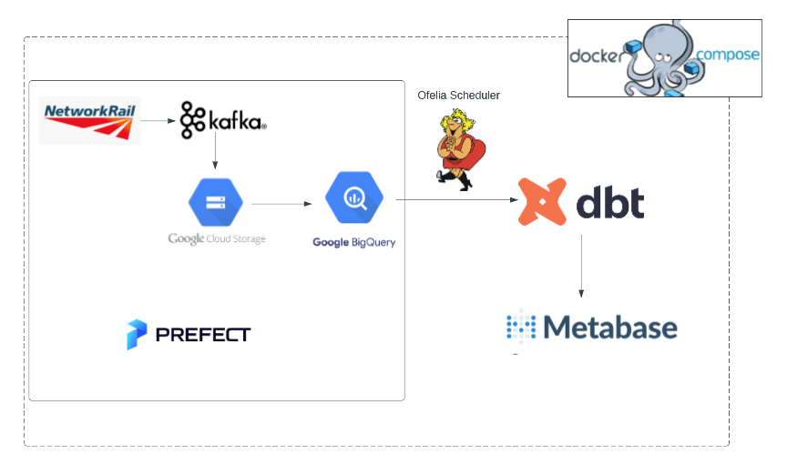

## Architecture diagram


Listing Topics
```docker exec -it kafka /bin/bash
/opt/bitnami/kafka/bin/kafka-topics.sh --bootstrap-server=kafka:9092 --list

# Create a topic
/opt/bitnami/kafka/bin/kafka-topics.sh --bootstrap-server kafka:9092 --topic TRAIN_MVT_ALL_TOC --create --partitions 2 --replication-factor 1
```


### References
- [Stomp - The Simple Text Oriented Messaging Protocol](https://stomp.github.io/index.html)
- [Python Rest Client Schema Registry](https://marcosschroh.github.io/python-schema-registry-client/)
- [Train Movement wiki](https://wiki.openraildata.com/index.php?title=Train_Movement)
- []()
- []()
- []()
- []()
- 
### Credits
- [On Track with Apache Kafka – Building a Streaming ETL Solution with Rail Data](https://www.confluent.io/en-gb/blog/build-streaming-etl-solutions-with-kafka-and-rail-data/)
- [KaitaiD / py-network-rail-feeder](https://github.com/KaitaiD/py-network-rail-feeder)
- [zkan / dtc-data-engineering-zoomcamp-project](https://github.com/zkan/dtc-data-engineering-zoomcamp-project)
- [openraildata / td-trust-example-python3](https://github.com/openraildata/td-trust-example-python3)
- []()
- []()
- []()
- []()