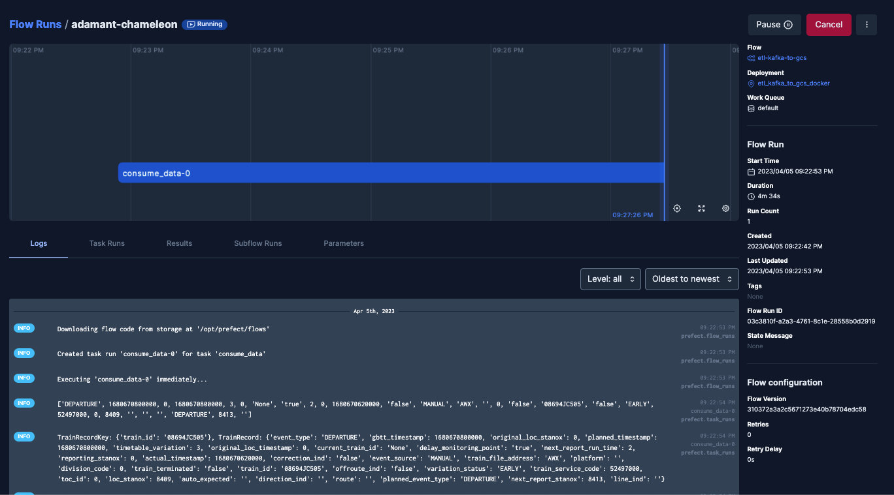
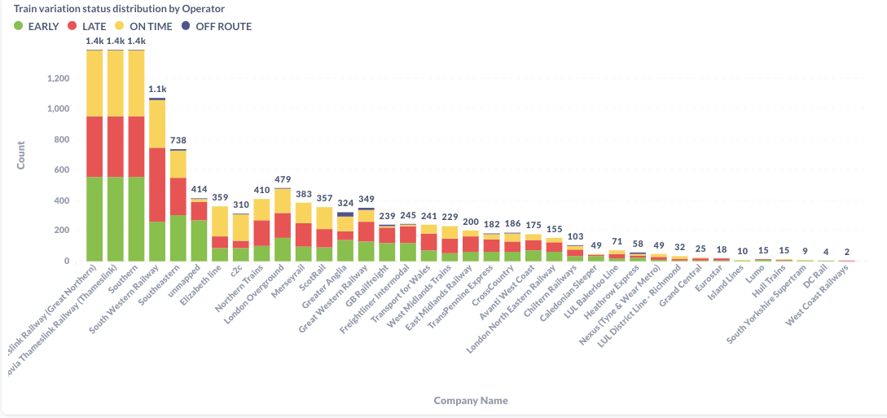
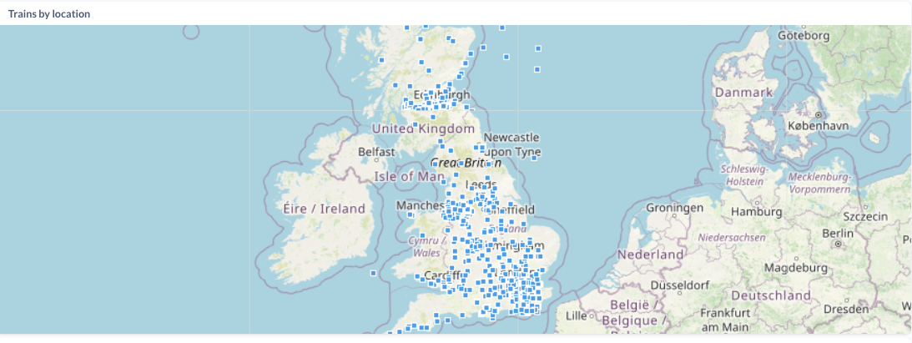

# DataTalksClub's Data Engineering Zoomcamp Project
## UK NetworkRail Operator performance Analysis

This is the final project as a part of the [Data Engineering Zoomcamp](https://github.com/DataTalksClub/data-engineering-zoomcamp/blob/main/README.md) course.
It includes an end-to-end data pipeline that streams train movement data along with a very basic analysis of their performance.
## Architecture diagram


## Problem description

The data is a [public feed](https://datafeeds.networkrail.co.uk/ntrod/myFeeds) provided by the UK’s Network Rail company through an ActiveMQ interface.There are 8 message type, this project is only focus on type "0003", train movements. The message includes the arrival, passing or departure of a train. Additionally, it records the time of the event.

Using this simple analysis, you can see how each train operator performs based on whether trains are early, late, on time, or off route. 

## Datasets
- train movements
- toc: Train Operator name
- ukrail_loc: UK railway station location


## Tech Stack
- [Prefect](): To orchestrating workflow
- [Docker Compose](https://docs.docker.com/compose/): This manages 15 dockers including Prefect, Kafka, SchemaRegistry, dbt, Postgres DB, Ofelia scheduler etc 
- [Docker](https://www.docker.com/): To containerize the code and infrastructure
- [Google BigQuery](https://cloud.google.com/bigquery): As Data Warehouse
- [Google Cloud Storage](https://console.cloud.google.com/getting-started): As Data Lake
- [Ofelia](https://github.com/mcuadros/ofelia): A docker job scheduler to run dbt Core
- [dbt](https://www.getdbt.com/): Run data transformation
- [metabase](https://github.com/metabase/metabase): Visualization of the findings

## Structure of the project
- ingest: datafeeder_avro.py is the entrypoint. It streams the TRAIN_MVT_ALL_TOC topic data from an ActiveMQ interface then send the message to the Kafka producer. The module includes a [MVListener](ingest/MQListenner.py) and [Avro Kafka producer](ingest/train_avro_producer.py).

- flows: This includes all the Prefect flows
    * etl_kafka_to_gcs_avro.py using an Avro consumer to subscrble the train_mov topic the write the message to gcs data lake. The data is partioned by toc code.
    
    * el_gcs_to_bq_batch.py runs an incremental batch load. 
    
- dbt-bq-train: Transformation using the dbt Core with BigQuery
        
- ofelia scheduler: A [scheduler](https://github.com/mcuadros/ofelia) to run cronjob from a running docker. It is used to run dbt
    ```
    # Ofelia use go crontab format, not the standard one
    # https://pkg.go.dev/github.com/robfig/cron
    # Field name   | Mandatory? | Allowed values  | Allowed special characters
    # ----------   | ---------- | --------------  | --------------------------
    # Seconds      | Yes        | 0-59            | * / , -
    # Minutes      | Yes        | 0-59            | * / , -
    # Hours        | Yes        | 0-23            | * / , -
    # Day of month | Yes        | 1-31            | * / , - ?
    # Month        | Yes        | 1-12 or JAN-DEC | * / , -
    # Day of week  | Yes        | 0-6 or SUN-SAT  | * / , - ?

    [global]
    save-folder = /etc/logs

    [job-exec "job-dbt-scheduler"]
    # schedule = @every 90s #use prebuild intervals
    # schedule = 0 10 */1 * * *
    schedule = 0 */10 * * * *
    container = dbt-bq-train
    command = dbt run
    ```
    

- resources: This includes the Avro schemas which will be shared in the Prefect-Agent and datafeeder docker containers

- utilities: This includes the Kafka producer settings and TrainRecord Class
## Results






### Conclusion

There are roughly two full days of data in the data sets. A total of 13,479 records were captured, of which 34% are late, 36% are early, 28% are on time, and the rest are off route. West Coast Railways and DC Rail have the highest percentage of delays with more than 50% of trains running late.

### Inprovements

- Create a Prefect deployment to run dbt core
- Create a CI/CD with Github actions
- Improve the setup.sh to fully automate the process
- Use Streamlit for the Analytics
### References
- [Stomp - The Simple Text Oriented Messaging Protocol](https://stomp.github.io/index.html)
- [Python Rest Client Schema Registry](https://marcosschroh.github.io/python-schema-registry-client/)
- [Train Movement wiki](https://wiki.openraildata.com/index.php?title=Train_Movement)

### Credits

This project would not have been possible without the DataTalksClub team behind these courses and all the members who helped me along the way.

- [On Track with Apache Kafka – Building a Streaming ETL Solution with Rail Data](https://www.confluent.io/en-gb/blog/build-streaming-etl-solutions-with-kafka-and-rail-data/)
- [KaitaiD / py-network-rail-feeder](https://github.com/KaitaiD/py-network-rail-feeder)
- [zkan / dtc-data-engineering-zoomcamp-project](https://github.com/zkan/dtc-data-engineering-zoomcamp-project)
- [openraildata / td-trust-example-python3](https://github.com/openraildata/td-trust-example-python3)
